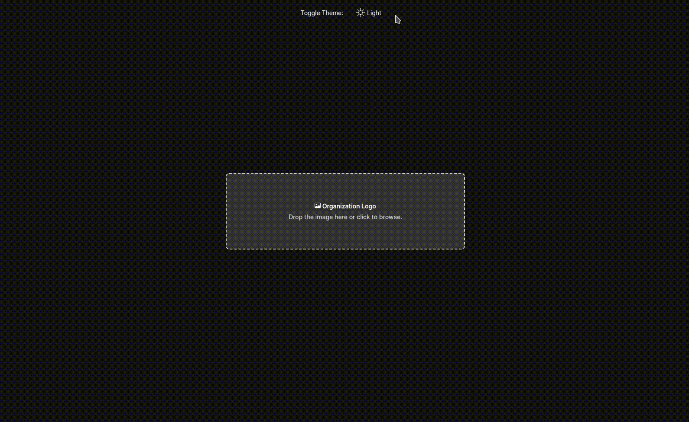
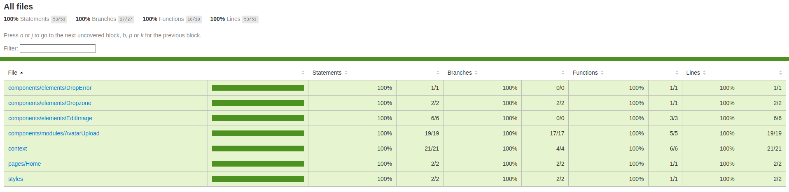
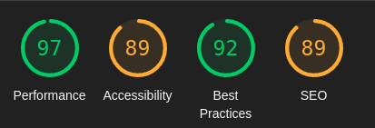

# Crop Image


## Preview



## Demo

<a href='https://crop-image-woad.vercel.app/' target="__blank" >DEMO</a>

## Description

This project is a frontend challenge to [Croct](https://croct.com/), you can upload a image and crop.

## Objectives

- [x] It should allow uploading an image by dragging it into the dashed area or clicking on it.
- [x] Throughout the entire process, the user can click on the "X" icon to cancel and return to the initial state
- [x] After upload, the user can adjust the image to better fit the circular format. Using a slider, the user can zoom in and out on the image cut out by the circular mask to preview the final result.
- [x] Clicking on save, the component should display the cropped logo and a button to restart the process. It must also provide some way for parent components to access the resulting image's raw data.

## Tests

| File      | % Stmts | % Branch | % Funcs | % Lines |
| --------- | ------- | -------- | ------- | ------- |
| All files | 100     | 100      | 100     | 100     |



---

## Performance

| File      | Performance | Accessibility | Best Practices | SEO |
| --------- | ----------- | ------------- | -------------- | --- |
| All files | 97          | 89            | 92             | 89  |



---

---

## Installation and execution

**Installation of dependencies**

```
yarn
```

To run in development mode

```
yarn dev
```

To view stories in **StoryBook**:

```
yarn storybook
```

To run **Tests**:

```
yarn test
```

---

## Additional functions

- [x] Used on mobile
- [x] 100% test coverage
- [x] Dark theme
- [x] Storybook
